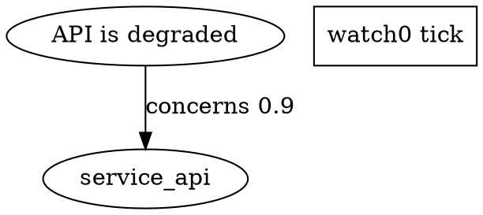

# GAL:netlist draft specification

Status: draft v0.1

GAL means Graph Abstraction Layer. GAL:netlist is the line-oriented interchange
format for graph-runtime state: nodes, edges, signal wiring, standing operations,
and parameter changes in one inspectable file.

GAL:netlist keeps the notation and sentence structure already used by MAL. MAL
is a dialect of GAL, not a separate syntax family. GAL owns the reusable grammar
shape; MAL specializes that grammar for memory graphs: claims, evidence,
contradiction, confidence, currency, salience, and standing memory programs.

## 1. Goals

GAL:netlist exists to make graph runtimes easy to inspect, share, convert, and
tune.

It must:

- Be readable after learning a small number of sentence shapes.
- Parse into a stable AST.
- Render back into canonical text.
- Preserve graph-runtime meaning across conversion tools.
- Support reusable operations implemented once in code and instanced many times in
  netlists.
- Keep runtime wiring auditable without mentally executing Python, JavaScript, or
  framework code.

It does not try to:

- Round-trip arbitrary YAML, DOT, JSON, or source-code formatting byte for byte.
- Replace host languages for implementing components.
- Become a general programming language.
- Hide graph state behind control flow.

## 2. Core Model

A GAL document describes five semantic objects:

| object | purpose | GAL:netlist sentence form |
|---|---|---|
| node | an entity in the graph | `<id> "label" fields...` |
| edge | a directed typed relation | `<relation>> <target>(weight)` |
| net | signal wiring through an operation | `net <output> <op> <input>...` |
| standing op | scheduled reusable graph operation | `addf <opInstance> tick [params...]` |
| param set | runtime parameter tuning | `setp <target>.<param> <value>` |

Everything else is dialect vocabulary.

For example, MAL uses `claim`, `obs`, `supports`, `contradicts`, `watch`,
`drift`, `quorum`, `confidence`, and `currency`. A deployment dialect might use
`service`, `depends_on`, `health`, `rollout`, and `rollback`.

## 3. Design Principles

### 3.1 Semantic Round-Trip

The core parser must preserve semantic graph meaning:

```text
GAL text -> AST -> canonical GAL text -> AST
```

The second AST must be equivalent to the first. Comments and original whitespace
may be preserved by a concrete-syntax layer, but the required guarantee is
semantic round-trip.

### 3.2 One Line, One Action

Each non-comment line declares one graph fact, one wire, one scheduled operation,
or one parameter change.

### 3.3 Code Implements, GAL Instances

Reusable components are implemented in normal code. GAL instances them:

```gal
net alert or2 high_concern stale
addf watch0 tick [topics: api-status] [delta: 0.20]
```

### 3.4 Dialect-Gated Vocabulary

GAL core defines the shared syntax and AST categories. Dialects define legal node
kinds, edge relations, signal names, operation names, fields, and validation
rules.

## 4. Lexical Rules

### 4.1 Encoding

Files are UTF-8 text. Portable tooling should emit LF newlines.

### 4.2 Comments

`#` starts a comment unless inside a quoted string.

```gal
# service health monitor
addf watch0 tick [topics: api-status] [delta: 0.20] # tuned for noisy deploys
```

### 4.3 Identifiers

Core identifiers should use:

```text
[A-Za-z_][A-Za-z0-9_]*
```

Dialects may further restrict identifiers. For portable op instances, use a base
name followed by a numeric suffix:

```gal
watch0
watch1
drift0
score0
```

The hyphen character is reserved for dialect path syntaxes and should not be used
for ordinary operation instance names.

### 4.4 Quoted Strings

Labels and bodies use double-quoted strings. Escapes:

| escape | meaning |
|---|---|
| `\"` | double quote |
| `\\` | backslash |
| `\n` | newline |

### 4.5 Numbers

Numbers are decimal unless a dialect explicitly allows another notation.
Implementations should canonicalize numeric rendering by removing unnecessary
trailing zeros.

### 4.6 Bracket Parameters

Bracket parameters carry key/value lists:

```gal
[key: value1 value2 value3]
```

Examples:

```gal
[topics: api-status checkout]
[delta: 0.20]
[query: payment gateway outage]
```

The parser stores bracket values as strings. Dialect loaders may coerce values to
numbers, booleans, enums, or arrays.

## 5. Line Forms

### 5.1 Header

Optional but recommended:

```gal
@gal netlist.v0
@dialect mal.v0
```

Header lines declare the syntax version and dialect. A parser that does not
support headers may treat them as metadata nodes in the AST rather than rejecting
the file.

### 5.2 Node Line

Generic form:

```gal
<id> "<label>" <field(value)>... [key: values...]...
```

Example:

```gal
claim_ab12 "API is degraded" conf(0.82) eff(0.76) curr(0.91) sal(0.44) [kind: claim] [topics: api-status]
```

Node fields are compact numeric state. Bracket parameters are structured
metadata. Dialects decide which fields and parameters are valid.

Minimum AST:

```json
{
  "form": "node",
  "id": "claim_ab12",
  "label": "API is degraded",
  "fields": [{"name": "conf", "value": 0.82}],
  "params": [{"key": "kind", "values": ["claim"]}]
}
```

### 5.3 Body Line

`body` attaches free text to the most recent node.

```gal
body "The API returned elevated 5xx errors between 10:00 and 10:05."
```

AST:

```json
{ "form": "body", "text": "..." }
```

### 5.4 Edge Line

Cell-attached form, scoped to the most recent node:

```gal
<relation>> <target>(<weight>)
```

Explicit-source form:

```gal
<source> <relation>> <target>(<weight>)
```

Reverse direction is allowed with `<`:

```gal
<source> <relation>< <target>(<weight>)
```

Examples:

```gal
concerns> service_api(0.9)
claim_ab12 supports> source_cd34(0.8)
```

AST:

```json
{
  "form": "edge",
  "source": "claim_ab12",
  "relation": "concerns",
  "direction": "fwd",
  "target": "service_api",
  "weight": 0.9
}
```

### 5.5 Net Line

`net` wires derived signals through reusable operations.

```gal
net <output> <op> <input>...
```

Examples:

```gal
net alert or2 high_concern stale
net route lut5 weak stale review pinned annexed
```

AST:

```json
{
  "form": "net",
  "output": "alert",
  "op": "or2",
  "inputs": ["high_concern", "stale"]
}
```

Dialects define available ops. Core suggested ops:

| op | arity | meaning |
|---|---:|---|
| `not1` | 1 | boolean not |
| `and2` | 2 | boolean and |
| `or2` | 2 | boolean or |
| `xor2` | 2 | boolean xor |
| `lut5` | 5 | five-input lookup table/personality op |

### 5.6 Standing Operation Line

`addf` schedules a reusable operation on a runtime thread.

```gal
addf <opInstance> <thread> [params...]
```

The first required thread is `tick`.

Examples:

```gal
addf watch0 tick [topics: api-status] [measure: effective_confidence] [delta: 0.20]
addf drift0 tick [topics: api-status] [measure: effective_confidence] [delta: 0.30]
addf trend0 tick [topics: api-status] [measure: effective_confidence] [delta: 0.10]
addf score0 tick [topics: api-status]
```

`watch0` means instance 0 of the base `watch` operation. Dialects should resolve
numeric suffixes by longest known base operation:

```text
watch0 -> base watch, instance 0
tag_projection0 -> base tag_projection, instance 0
emit_witness2 -> base emit_witness, instance 2
```

AST:

```json
{
  "form": "schedule",
  "op": "watch0",
  "base": "watch",
  "instance": 0,
  "thread": "tick",
  "params": [{"key": "delta", "values": ["0.20"]}]
}
```

### 5.7 Parameter Set Line

`setp` tunes an existing node, net, or standing op.

```gal
setp <target>.<param> <value>
```

Examples:

```gal
setp watch0.delta 0.25
setp drift0.measure currency
setp alert.enabled true
```

AST:

```json
{
  "form": "set",
  "target": "watch0",
  "param": "delta",
  "value": "0.25"
}
```

## 6. Canonical AST

The canonical AST is the interop surface for converters.

```json
{
  "schema": "gal.netlist.ast.v0",
  "dialect": "mal.v0",
  "nodes": [],
  "edges": [],
  "nets": [],
  "schedules": [],
  "sets": [],
  "comments": [],
  "metadata": {}
}
```

A parser may also preserve line numbers:

```json
{
  "line": 12,
  "column": 1,
  "source": "addf watch0 tick [delta: 0.20]"
}
```

Line numbers are diagnostic metadata and are not part of semantic equality.

## 7. Conversion Contract

Every converter should route through AST:

```text
source format -> GAL AST -> target format
```

Required conversions:

- GAL text -> AST
- AST -> canonical GAL text
- AST -> JSON
- JSON -> AST

Recommended conversions:

- AST -> DOT for visualization
- AST -> YAML for configuration exchange
- AST -> Cypher for graph database import
- AST -> runtime import calls

Losslessness means preserving GAL semantic objects, not arbitrary source syntax in
foreign formats.

For example, YAML comments and DOT layout attributes do not have to survive unless
they are explicitly mapped into GAL metadata.

## 8. DOT Mapping

DOT is a visualization carrier, not the source of truth.

Mapping:

| GAL | DOT |
|---|---|
| node | DOT node |
| edge | DOT edge |
| net | DOT box node plus input/output edges |
| schedule | DOT box node with `thread=tick` |
| setp | DOT note/attribute on target |

Example:

```gal
claim_ab12 "API is degraded" conf(0.82) [kind: claim]
concerns> service_api(0.9)
addf watch0 tick [topics: api-status] [delta: 0.20]
```

DOT:



## 9. YAML Mapping

YAML mapping should be semantic:

```yaml
schema: gal.netlist.ast.v0
dialect: mal.v0
nodes:
  - id: claim_ab12
    label: API is degraded
    fields:
      conf: 0.82
    params:
      kind: [claim]
edges:
  - source: claim_ab12
    relation: concerns
    target: service_api
    weight: 0.9
schedules:
  - op: watch0
    base: watch
    instance: 0
    thread: tick
    params:
      topics: [api-status]
      delta: 0.20
```

## 10. Dialects

A dialect declares legal vocabulary and loader behavior while preserving the
GAL:netlist sentence structure.

Dialect schema:

```json
{
  "id": "mal.v0",
  "nodeKinds": ["claim", "obs", "task", "prg"],
  "relations": ["supports", "contradicts", "concerns", "depends_on"],
  "fields": ["conf", "eff", "curr", "sal", "unc", "concern"],
  "signals": ["weak", "stale", "review", "pinned", "annexed"],
  "netOps": ["not1", "and2", "or2", "xor2", "lut5"],
  "standingOps": ["score", "emit_witness", "tag_projection", "watch", "drift", "quorum", "trend", "reflex", "allocate"],
  "threads": ["tick"]
}
```

Dialects may define:

- Coercion rules for bracket params.
- Required fields for node kinds.
- Legal target selectors for standing ops.
- Runtime permissions.
- Import/export mappings.

### 10.1 Draft Dialect Family

GAL dialects share the GAL:netlist syntax and specialize graph vocabulary for a
runtime domain.

| dialect | name | domain |
|---|---|---|
| `mal.v0` | Memory Abstraction Language | claims, evidence, memory programs |
| `dal.v0` | Deployment Abstraction Layer | services, releases, rollout state |
| `pal.v0` | Policy Abstraction Layer | rules, obligations, decisions |
| `aal.v0` | Agent Abstraction Layer | agents, tools, tasks, handoffs |
| `wal.v0` | Workflow Abstraction Layer | steps, jobs, gates, retries |
| `oal.v0` | Observability Abstraction Layer | signals, alerts, traces, monitors |
| `hal.v0` | Hardware Abstraction Layer | devices, buses, drivers, firmware, capabilities |
| `ral.v0` | Resource Abstraction Layer | compute, storage, network, quota |
| `sal.v0` | State Abstraction Layer | state, snapshots, migrations, consistency |
| `eal.v0` | Event Abstraction Layer | events, streams, triggers, replay |
| `cal.v0` | Capability Abstraction Layer | permissions, tools, grants, negotiation |
| `ial.v0` | Interface Abstraction Layer | APIs, contracts, schemas, protocols |
| `tal.v0` | Topology Abstraction Layer | regions, clusters, routes, placement |
| `qal.v0` | Quality Abstraction Layer | SLOs, guarantees, constraints, correctness |
| `fal.v0` | Failure Abstraction Layer | failures, blast radius, recovery paths |
| `kal.v0` | Knowledge Abstraction Layer | concepts, sources, provenance |
| `real.v0` | Reasoning Abstraction Layer | hypotheses, plans, critiques, decisions |
| `lal.v0` | Learning Abstraction Layer | examples, feedback, evaluations, preference updates |
| `goval.v0` | Governance Abstraction Layer | ownership, authority, lifecycle, escalation |
| `riskal.v0` | Risk Abstraction Layer | risks, controls, mitigations, acceptance |
| `audal.v0` | Audit Abstraction Layer | evidence, attestations, receipts, trails |
| `val.v0` | Verification Abstraction Layer | tests, checks, proofs, acceptance criteria |

Detailed draft specs live under `docs/dialects/`.

## 11. MAL Dialect Sketch

MAL is the GAL dialect for memory graphs.

MAL fields:

| field | meaning |
|---|---|
| `conf` | stated confidence |
| `eff` | effective confidence after trust/decay |
| `curr` | currency/freshness |
| `sal` | salience |
| `unc` | uncertainty |
| `concern` | risk/concern |

MAL standing ops:

| op | purpose |
|---|---|
| `score` | summarize selected member scores |
| `emit_witness` | emit a witness for selected members |
| `tag_projection` | project tag values |
| `watch` | trip when aggregate value moves by a threshold |
| `drift` | trip and report movers |
| `quorum` | check agreement/count thresholds |
| `trend` | detect directional change |
| `reflex` | run small boolean personality over cell flags |
| `allocate` | rank work candidates |

Example:

```gal
@gal netlist.v0
@dialect mal.v0

claim_ab12 "API is degraded" conf(0.82) eff(0.76) curr(0.91) sal(0.44) [kind: claim] [topics: api-status]
body "Five-minute error window exceeded normal baseline."
concerns> service_api(0.9)
supports> log_cd34(0.8)

net alert or2 high_concern stale
net route lut5 weak stale review pinned annexed

addf watch0 tick [topics: api-status] [measure: effective_confidence] [delta: 0.20]
addf drift0 tick [topics: api-status] [measure: currency] [delta: 0.30]
setp watch0.delta 0.25
```

## 12. Parser Requirements

A conforming parser must:

1. Split lines while preserving line numbers.
2. Ignore blank lines.
3. Support trailing comments outside quoted strings.
4. Tokenize quoted strings and bracket params as single tokens.
5. Return typed AST nodes for all known line forms.
6. Return structured errors instead of silently dropping bad lines.
7. Never execute operations during parse.

Error shape:

```json
{
  "line": 7,
  "column": 1,
  "code": "unknown_form",
  "message": "line matches no GAL form",
  "text": "..."
}
```

## 13. Loader Requirements

A loader applies a GAL AST to a runtime.

Modes:

| mode | behavior |
|---|---|
| `verify` | read-only; validate that runtime matches AST |
| `replay` | create graph in a fresh runtime |
| `merge` | apply AST into an existing runtime |
| `plan` | produce intended changes without applying |

Loaders must report:

- Nodes admitted.
- Edges attached.
- Nets acknowledged or created.
- Standing ops scheduled.
- Params set.
- Unsupported forms.
- Rejections with reasons.

## 14. Renderer Requirements

A renderer emits canonical GAL.

Canonical renderer rules:

- One semantic object per line.
- Header first, if present.
- Nodes before attached body/edges.
- Nets before schedules.
- Schedules before param sets.
- Stable sorting when input order is not semantically meaningful.
- Decimal numbers normalized.
- Strings escaped.

## 15. Component Registry

GAL should support a registry of reusable operations.

Registry entry:

```json
{
  "id": "or2",
  "kind": "net_op",
  "arity": 2,
  "inputs": ["bool", "bool"],
  "output": "bool",
  "version": "1.0.0"
}
```

Standing op entry:

```json
{
  "id": "watch",
  "kind": "standing_op",
  "threads": ["tick"],
  "params": {
    "topics": {"type": "string[]"},
    "query": {"type": "string"},
    "measure": {"type": "string", "default": "effective_confidence"},
    "delta": {"type": "number", "default": 0.15}
  }
}
```

## 16. Compatibility Rules

Recommended compatibility policy:

- New fields may be added to AST objects.
- Unknown bracket params should be preserved unless the selected dialect rejects
  them.
- Unknown line forms should produce parser errors.
- Unknown operations should parse but fail dialect validation or load.
- Older aliases may be accepted by a dialect, but canonical render should emit
  the preferred form.

For MAL, `watch-0` may be accepted as a compatibility alias, but canonical render
should emit `watch0`.

## 17. Minimal CLI Shape

Suggested commands:

```bash
gal parse graph.gal --json
gal format graph.gal
gal verify graph.gal
gal convert graph.gal --to json
gal convert graph.gal --to dot
gal convert graph.gal --to yaml
gal load graph.gal --mode plan
gal load graph.gal --mode replay
```

## 18. Open Decisions

1. Header syntax: keep `@gal`/`@dialect`, or use comment pragmas?
2. Node keyword: keep compact `<id> "label"` or add explicit `node <id> "label"`?
3. Path syntax: standardize dialect paths or leave them dialect-specific?
4. Registry resolution: local files, package names, URLs, or all three?
5. Permissions: how should dialects mark operations as safe, privileged, or
   read-only?
6. Canonical ordering: preserve author order by default, or sort by semantic type?
7. Concrete syntax preservation: required later, or always an optional editor
   layer?

## 19. First Implementation Milestones

1. Freeze core AST shape.
2. Implement parser for node, edge, body, net, addf, setp, comments.
3. Implement canonical renderer.
4. Add semantic round-trip tests.
5. Add JSON emitter/loader.
6. Add DOT emitter.
7. Add dialect validator.
8. Port current MAL netlist support onto the GAL AST.
9. Add registry metadata for core net ops and MAL standing ops.
10. Build `gal convert` CLI.
