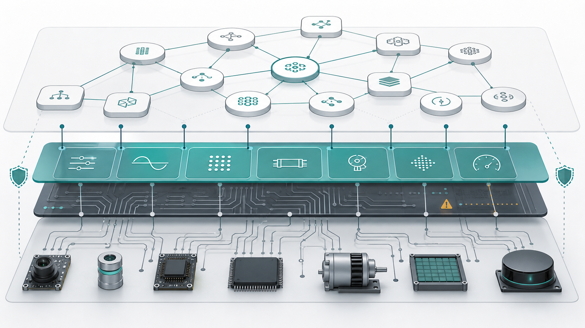

# HAL as a Boundary Discipline for Graph Runtimes

The GAL Hardware Abstraction Layer is not a device-driver API. It is a graph
lens for describing hardware substrate state in a way that other runtime
dialects can safely consume.

Classic HAL systems keep hardware diversity behind a stable boundary. Operating
systems use HALs to hide low-level platform differences from kernels and
drivers. Embedded stacks use HAL and common I/O layers to expose portable
operations across different boards, MCUs, and peripherals. Devicetree systems
turn physical hardware layout and initial configuration into data that can be
checked before code runs.

GAL borrows those ideas and maps them into graph vocabulary.

## What HAL Models

HAL models concrete substrate facts:

- `device`, `bus`, `driver`, `firmware`, `adapter`, and `capability` nodes.
- `sensor`, `interrupt`, `dma`, and `register` nodes when lower-level state
  needs to be visible.
- Relations such as `attached_to`, `driven_by`, `supports`, `requires`,
  `compatible_with`, `maps_to`, and `streams_to`.
- Signals such as `present`, `ready`, `faulted`, `degraded`, `thermal`,
  `reset_required`, `capable`, and `compatible`.

The important discipline is that HAL exposes enough for schedulers, policy
engines, verifiers, and observability systems to reason about hardware without
making them understand vendor-specific registers or unsafe mutation paths.

## Cross-Dialect Handoffs

HAL should hand facts to adjacent dialects:

- RAL consumes device and bus capacity for resource planning.
- TAL consumes attachment and mapping relations for placement.
- IAL consumes compatibility and exposed capabilities for interface matching.
- OAL and FAL consume hardware signals for alerts and recovery.
- VAL consumes probe and firmware evidence for verification gates.

## Safety Rule

`verify` mode must inspect only. Resetting a device, binding a driver, flashing
firmware, or changing DMA state belongs behind privileged, explicit loader
actions. A graph format should make those actions visible; it should not hide
them as incidental parsing side effects.
